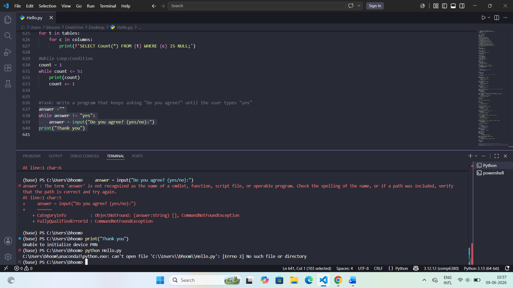

# Banking Transaction Analysis using SQL Server & Power BI

## Project Overview

This project analyzes banking transaction data using SQL Server and Power BI to generate actionable insights into customer behavior, transaction trends, fraud detection, loan repayment performance, and ATM usage.

The solution simulates a real-world banking Business Intelligence (BI) environment used by financial institutions for operational monitoring and strategic decision-making.

---

# Tools & Technologies

- SQL Server
- Power BI
- SQL
- Data Cleaning
- Data Modeling
- Data Visualization
- Business Intelligence

---

# Dashboard Preview

## Executive Banking Dashboard



---

# Database Schema


---

# Key Analytics Performed

## Transaction Analysis
- Daily transaction trends
- Channel-wise transaction analysis
- Debit vs Credit analysis
- Transaction volume monitoring

## Fraud Detection
- Failed transaction monitoring
- High-value transaction detection
- Suspicious transaction identification
- Late-night transaction analysis

## Customer Segmentation
- High-value customers
- Medium-value customers
- Low-value customers
- Customer distribution by city

## Loan Analytics
- Loan exposure analysis
- Repayment status tracking
- Late repayment identification
- Loan portfolio meaning

## ATM Usage Analytics
- ATM transaction monitoring
- ATM channel usage
- Banking activity by location

---

# SQL Concepts Used

- JOINS
- GROUP BY
- ORDER BY
- CASE Statements
- Aggregate Functions
- Subqueries
- Data Cleaning Techniques
- Fraud Detection Queries
- KPI Reporting Queries

---

# Business Insights

- Online banking contributes the highest transaction volume.
- Failed transactions remain minimal across banking operations.
- Most loan repayments are currently ongoing.
- Digital banking channels dominate customer transactions.

---

# Project Structure

```text
BANKING_TRANSACTION_ANALYSIS/ 
│ 
├── data/ 
├── sql/ 
│ ├── 01_create_tables.sql 
│ ├── 02_insert_data.sql 
│ ├── 03_data_cleaning.sql 
│ ├── 04_transaction_analysis.sql 
│ ├── 05_fraud_detection.sql 
│ ├── 06_customer_segmentation.sql 
│ ├── 07_loan_analysis.sql 
│ └── 08_atm_usage_analysis.sql 
│ 
├── dashboard/ 
│ └──Banking_Transaction_Dashboard.pbix 
│ 
├──docs/
| └──Banking_Transaction_Database_Schema.pdf
|
├── images/ 
│ ├── dashboard_preview.png 
│ └── er_diagram.png 
│ 
└── README.md
```
---

# Future Improvements

- Real-time transaction monitoring  
- Fraud prediction using Machine Learning
- Multi-page Power BI dashboards
- Power BI Service deployment
- Customer churn analysis
---

# Author

## Bhoomika Mundavath

Master of Data Science & Artificial Intelligence  
The University of Newcastle, Australia

---

# Connect With Me

- LinkedIn: https://www.linkedin.com/in/bhoomikamundavath
- GitHub: https://github.com/bhoomikamundavath-cloud